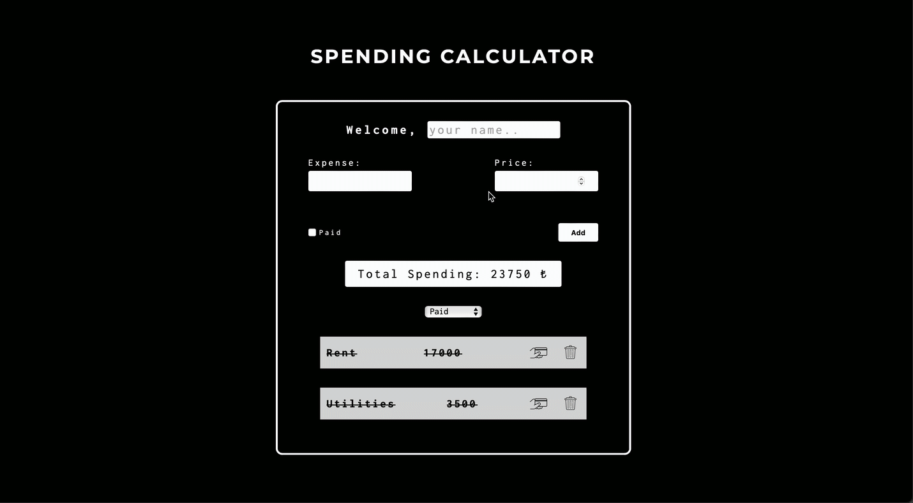

# spending_calculator

<h1>Spending Calculator</h1>

Spending Calculator is a simple yet effective tool to manage and track your personal expenses. This project, built with HTML, CSS, and JavaScript, helps you keep track of your spending by allowing you to input expenses, mark them as paid or unpaid, and view your total spending in real-time. Ideal for personal budgeting or expense tracking, this tool provides a clean and straightforward interface for efficient financial management.

<h1>Features</h1>

<link>

- Add Expenses: Enter details for each expense, including the description and amount.

- Mark as Paid: Use the checkbox to indicate whether an expense has been paid.

- Total Spending Calculation: Automatically updates and displays the total amount of expenses.

- Filter Expenses: View all expenses or filter by paid and unpaid status.

- Interactive Expense List: Easily manage expenses with options to remove items and see real-time updates.

- User-Friendly Interface: Designed with simplicity in mind, ensuring an intuitive experience for all users.

</link>

<h1>Preview:</h1>

